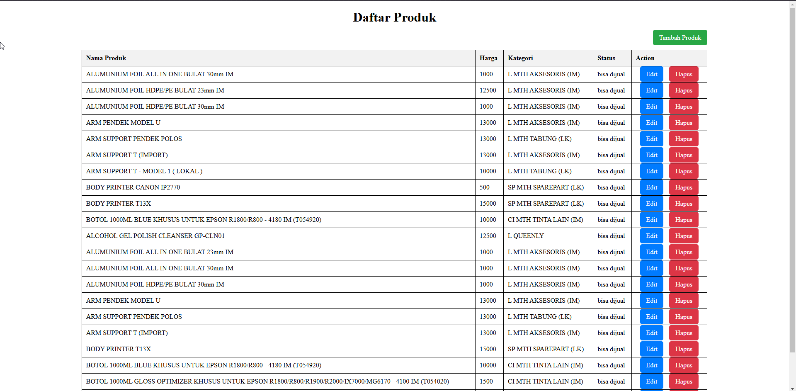
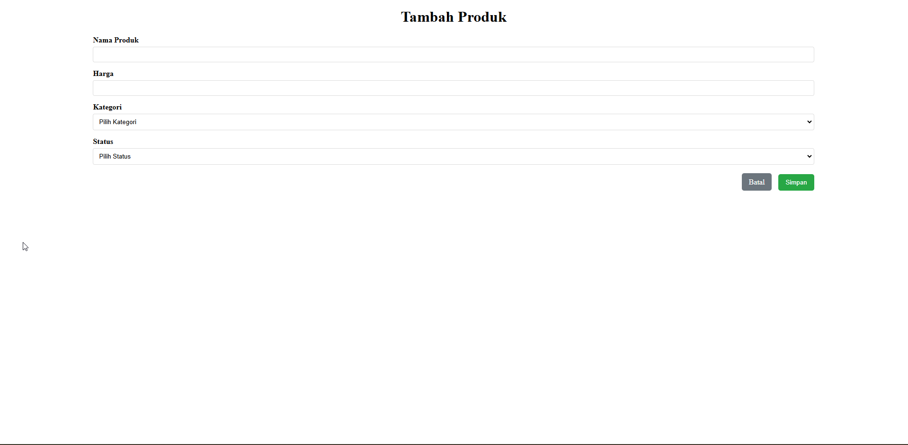
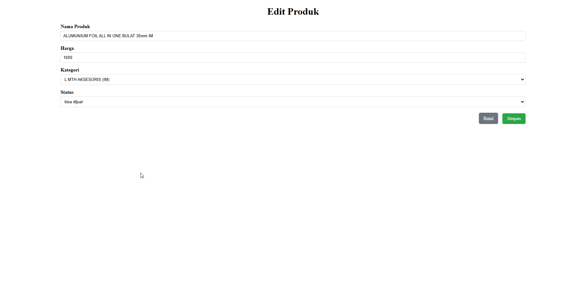
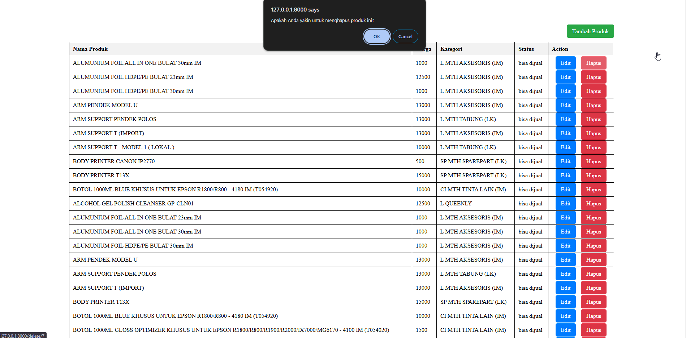

# **Dokumentasi Proyek Django**

## **Fastprint Product List**  
**Manajemen Produk dengan Django**  

## **Deskripsi Proyek**  
Aplikasi ini dirancang untuk mengelola data produk, termasuk fitur menambah, mengedit, menghapus, dan menampilkan produk. Proyek ini menggunakan framework Django dan mendukung sinkronisasi data melalui API serta pengelolaan data dengan serializer.

---

## **Fitur Utama**  
1. **Manajemen Produk**
   - Tambah produk baru dengan informasi kategori dan status.  
   - Edit produk yang sudah ada.  
   - Hapus produk dengan konfirmasi.  
   - Tampilkan daftar produk yang tersedia.  

2. **Sinkronisasi Data**  
   - Sinkronisasi data produk dari API eksternal digunakan untuk mengambil data.  

3. **Pemberitahuan (Flash Messages)**  
   - Tampilkan pesan notifikasi saat operasi berhasil (misalnya, penambahan atau penghapusan produk).  

4. **Penggunaan Serializer**  
   - Serialisasi data produk untuk integrasi yang lebih baik dengan API atau kebutuhan lain.

---

## **Struktur Proyek**

```plaintext
Fastprint/
├── testfastprint/
│   ├── migrations/
│   ├── templates/
│   │   ├── add_produk.html
│   │   ├── edit_produk.html
│   │   ├── produk.html
│   ├── serializers.py
│   ├── views.py
│   ├── models.py
│   ├── urls.py
├── manage.py
├── Fastprint/
│   ├── settings.py
│   ├── urls.py
│   ├── wsgi.py
```
## **Langkah Instalasi**
**1. Kloning Repository**

`git clone https://github.com/firhanaf/tes-junior-programmer.git`

`cd Fastprint`

**2. Buat dan Aktifkan Virtual Environment**

`python -m venv env`

`source env/bin/activate  # Untuk Linux/Mac`

`env\Scripts\activate     # Untuk Windows`

**3. Instal Dependensi**

`pip install -r requirements.txt`

**4. Konfigurasi Database**
  
Edit file settings.py untuk menyesuaikan konfigurasi database. 

Contoh konfigurasi default menggunakan MySQL:
  
`DATABASES = {
    'default': {
        'ENGINE': 'django.db.backends.mysql',
        'USER': config('DB_USER'),
        'PASSWORD': config('DB_PASS'),
        'PORT': config('DB_PORT'),
        'HOST': config('DB_HOST'),
        'NAME': config('DB_NAME'),
    }
}`

**5. Jalankan Migrasi**

`python manage.py makemigrations`

`python manage.py migrate`

**6. Jalankan Server**

`python manage.py runserver`

  - Buka aplikasi di browser: http://127.0.0.1:8000.

---

## **Dokumentasi API**

**1. Endpoint Sinkronisasi Data**

Endpoint ini digunakan untuk mengambil data dari API eksternal yang telah disediakan dan akan menyimpan data response ke dalam database yang telah disiapkan sebelumnya

`URL: /sync-data/
Metode: POST
Respon:
{
    "status": "success",
    "message": "Data synced successfully."
}`

---

## **Screenshots**
## **1. Halaman Daftar Produk**

Menampilkan daftar produk yang dapat dijual.



## **2. Halaman Tambah Produk**

Form untuk menambahkan produk baru.



## **3. Halaman Ubah Produk**

Form untuk mengubah produk yang telah ada



## **4. Konfirmasi Hapus Produk**

Popup konfirmasi ketika akan menghapus produk



---

## **[Demo Project](https://www.example.com)**

---

---

### **Kontak**

Jika Anda memiliki pertanyaan atau saran, silakan hubungi:

Nama: Firhan Ahmad F

Email: firhanahmadf@gmail.com

GitHub: https://github.com/firhanaf

